# myvizdoom
This repository represents preliminary work that was a collaborative project between the [Kemere lab](https://rnel.rice.edu/) and [Patel lab](https://ankitlab.co/) at Rice University during 2017-2018 that investigated the basis of navigation in artificial neural networks, particularly within the context of the [ViZDoom platform](https://github.com/Farama-Foundation/ViZDoom/tree/master).

## Overview
ViZDoom utilizes a combination of scenarios (`.wad` files), configurations (`.cfg` files), and actual experimental code, which can be written in C++ (originally) or in Python or Java (built-in wrappers). This structure models the basic flow of reinforcement learning: a series of interactions between the agent (ANN) and environment (ViZDoom). We have the ability to manipulate both in order to fine tune learning. 

The scenario, with help from configuration files, determines much of the behavior of the *environment*. A major advantage of the ViZDoom platform is the ability to modify situations in order to better model specific real-world scenarios. Use an IWAD editor (such as Slade3) to create and modify worlds. 

The experiment code, on the other hand, describes the behavior of the *agent*. The neural network structure and possible outputs are created and modified using C++, Python, or Java. Modifications such as replay, exploration, The code also determines the details of the experiment, such as the learning algorithms and the length of training epochs.

The code is generally strutured to be modular whenever possible, which manifests as a core codebase that runs training and testing scripts (`myvizdoom/python`), the specifics of which depend on the reinforcement learning agent (`myvizdoom/agents`); underlying neural network (`myvizdoom/networks`) that implements such agent; and ZDoom scenarios (`myvizdoom/scenarios`) and corresponding configuration files (`myvizdoom/scenarios`) in which the agent acts.

**UPDATE**: The repository can now handle two additional training "environments" for deep reinforcement learning networks: `gridworld` and OpenAI's Atari2600 emulator in `gym`.

## Initial Setup
All further documentation can be found under the `docs` subdirectory.

For instructions about installing and configuring the computing environment, please see the [installation guide](./docs/InstallationGuide.md).

For a more detailed explanations of ViZDoom scenarios, please see the guide to [creating scenarios](./docs/CreatingScenarios.md) or a list of [scenario descriptions](./docs/ScenarioDescriptions.md).

## Usage Guide
The general workflow is as follows:
1. Create a ViZDoom scenario (`.wad` file in `scenarios`).
2. Configure specifics of the ViZDoom scenario (`.cfg` file in `config`).
3. Build a neural network (`.json` in `network`) to implement a deep reinforcement learning agent.
4. Configure specifics of the DRL agent (`.json` in `agent`).
5. Train the DRL network. The workhorse of this step is found in `python/learn_env.py`:
    ```bash
    $ python learn_env.py <args>
    ```
6. Test the trained DRL network.
    ```bash
    $ python test.py <args>
    ```
7. Investigate the network further, such as decoding internal states (`python/decode.py`) or visualizing node activity (`python/visualize_neurons.py`).

The following DRL agents and skeleton networks are currently available (which, as mentioned above, are configured via files in `agents` and `networks`, respectively):
- Deep Q-Network (DQN)
- Double Deep Q-Network (DDQN)
- Deep Recurrent Q-Network (DRQN)
- Double Deep Recurrent Q-Network (DDRQN)
- Actor-Critic with Experience Replay (ACER)
- Asynchronous Advantage Actor Critic (A3C)

| 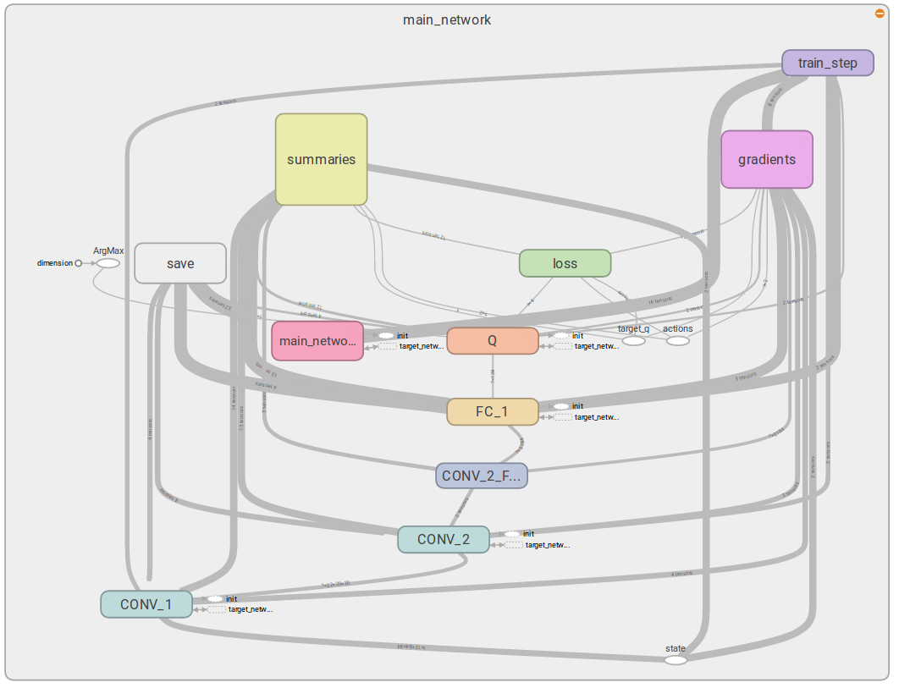 |
|---|
| *Example of a DQN implementation created via Tensorflow that is visualized on Tensorboard.* |

The agent may include replay memory while training, including:
- Prioritized Experience Replay (PER): Experiences are replayed proportional to their likelihood of being encountered.
- Trajectory Experience Replay: Contiguous position segments are sampled rather than independent time points.

| 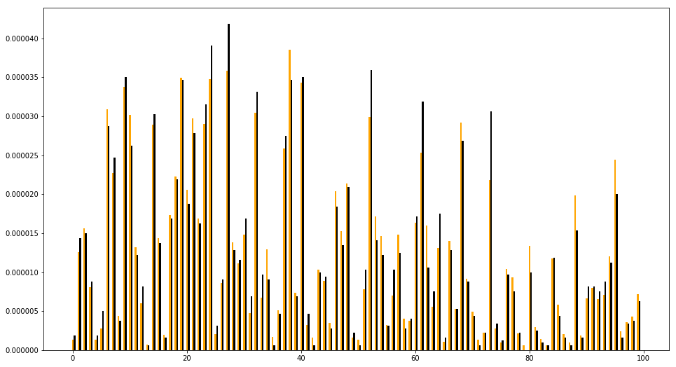 |
|---|
| *An example of a PER implementation. The frequency of an experience being encountered in training (orange) is compared to the frequency of such experience being replayed (black).* |

Additionally, much of the investigative work can be found in the `notebooks` subdirectory, which contains iPython notebooks that investigate a variety of topics. Selected notebooks are shown in **bold**.
- Theory, development, results, and troubleshooting related to various DRL agents (**`actor_critic.ipynb`**, `dueling_dqn.ipynb`, **`prioritized_experience_replay.ipynb`**)
- General theory and explanations of topics related to artificial neural networks (`backprop_examples.ipynb`, **`hessian_free.ipynb`**, **`rnn.ipynb`**)
- Investigations of DRL networks (**`perturbation_saliency.ipynb`**, `fc_output.ipynb`, `visualizing_states.ipynb`)
- Testing implementations of deep neural networks (`layers.ipynb`, `lowlevel_tf.ipynb`, `network_builder.ipynb`, `network_visualization.ipynb`)
- Testing implementations of environments (`gridworld.ipynb`, `zdoom_physics.ipynb`)

## Selected Examples
The ability to create custom scenarios, networks, and associated DRL agents in the ViZDoom (and now gridworld and Atari emulator) environment presents many opportunities to investigate artifical neural networks in the context of navigation and decision-making. A few examples are shown below.

### Navigation
The richness of textures, objects, and other features available in scenarios allows for agents to explore and navigate in a plethora of mazes. For example, the goal may be to reach a particular location (left) and to collect certain objects (right).

|  | 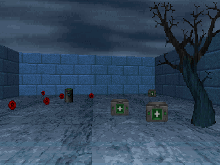 |
| --- | --- |
| *Double DQN agent navigating to goal.* | *A3C agent collecting medikits.* |

You can even have some fun by adding different monsters.

|  |  |
| --- | --- |
| *Double DQN agent collecting medikits...* | *and avoiding a monster!* |

### Probing layers of a network
Once an agent is trained in a particular environment, the information contained within individual layers may be illuminated via a variety of mechanisms. In one example, an agent was trained to navigate in an open field notable for objects, wall textures, or wall colors. Afterward, a multilayer perceptron was trained to decode position from the penultimate fully-connected layer of the DRL agent (i.e. the layer prior to the outputs). The latter two perform notably better as more information is present in each frame (state), whereas position is difficult to localize without objects in view (in networks with no memory state).

| 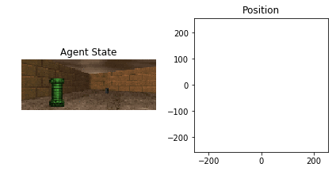 | 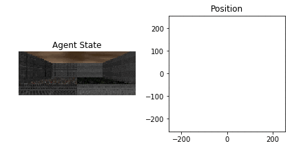 | 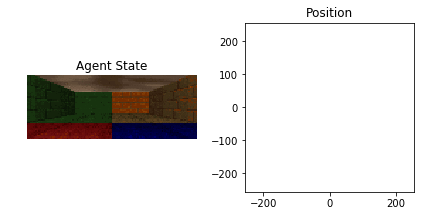 |
|:-:|:-:|:-:|
| *objects* | *textures* | *colors* |

Additionally, we can visualize weights of specific layer filters and connections, such as the early convolutional layers that may display pattern recognition devices in mimicry of the visual cortex (V1). 

| 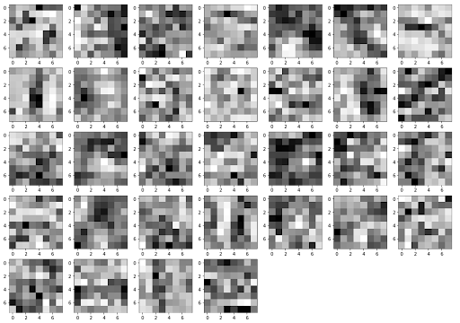 |
|---|
| *Filter weights from selected neurons in the first convolutional layer (8x8 kernel).* |


We can also ask which states (in this case, frames) and corresponding map positions occurred when the node was maximally activated in the network. If we apply this principle to the last fully-connected layer prior to output (Q-value in the case of Q-learning agents), we can learn how each node contributes to the likelihood (or unlikelihood) of taking a specific action given particular situations.

| 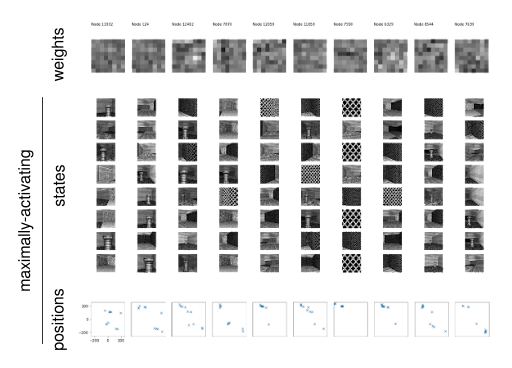 |
|---|
| *Filter weights (top) from selected units with corresponding states (middle) and positions (bottom) at which the nodes were maximally active.* |

| 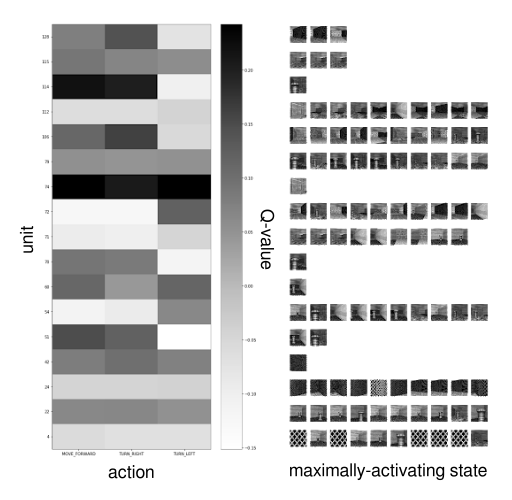 |
|---|
| *For select units in the penultimate fully-connected layer (rows), the value of the weights (grayscale) are shown for each of the three possible actions (columns), as well as maximally-activating states (right).* |

### Saliency map
There are many other ways to delve into the features on which the DRL is basing its decision-making. For example, the following paper

*Greydanus et al., Visualizing and Understanding Atari Agents, 2017. arXiv.org*

suggested measuring the change in Q-values after perturbing select components of a state (in this case, blurring an area of the image). Those areas that yield the largest changes in Q-values when blurred are likely more important to the decision-making process underlying the network. Per the publication, the saliency of such pixels are defined as:

$$
S_Q(t,i,j) = \frac{1}{2} \left \| Q(I_{1:t}) - Q(I'_{1:t}) \right \|^2
$$

which can be visualized by altering each frame in line with its corresponding saliency, such as the below examples.

| 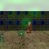 &emsp; &emsp; &emsp; 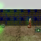 |
|:-:|
| *Two examples of a DRQN agent collecting medikits while avoiding a monster. Within each frame, values were added to the green channel of each pixel that were proportional to its corresponding saliency. Consequently, green areas visualized above are more likely to be important to the agent's decision about its next action.* |
