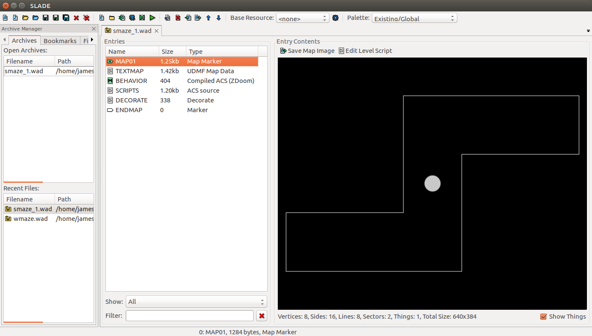

# Writing scripts and config files for ViZDoom
## General workflow 

Scenarios, or environments, in ViZDoom are contained in an internal WAD ("**W**here's **a**ll the **d**ata?"), or IWAD, file, which has the `.wad` extension. The editor we use is called SLADE, which allows us to build everything from the physical components in which a player traverses to the rules of the game.



In the screenshot above, several `.wad` files are loaded, with `linear_track.wad` being currently loaded. Looking at the Entries list, we see that this file has several components. It consists of one or *Maps* (in this case, just MAP01) that determine the physical structure of the scenario. Editors such as SLADE allow us to create mazes graphically, which is more intuitive, but the file itself represents these maps as a series of vertices and lines, which is encoded in the *Textmap* file. In addition to maps, scenarios also contain *Behavior* that describes how objects behave within the world. This is the compiled version of *Scripts*, which is written in ACS programming language. Finally, there is an optional *DECORATE* file that contains custom *actors*, or objects and things, that can created with particular features. 

As you can see, there are several components of an IWAD file, many of which overlap. In fact, there are often multiple ways to do the same thing on the map. For example, if we wanted to create a statue that, when bumped, caused damage, we could 1) create the *Thing* on the map editor and assign it special features; 2) spawn the *Thing* with ACS and encode its damaging act in the script; or 3) create a new actor class in *DECORATE* with these features and then spawn an instance of this actor in the script. 

## Documentation 

Available game buttons and variables: see `ViZDoom/docs/Types.md `

## Rewards 

Rewards, other than `living_reward` and `death_penalty`, are built into the `.wad` files. Thus each "scenario" dictates the structure of rewards, which is built into the ACS code. If you want to try different reward structures within the same maze, then you must construct separate `.wad` files for each ACS script. 

The `game.make_action` command, which is a combination of `game.set_action`, `game.advance_action`, and `game.get_last_reward`, obtains the reward from the global variable 0. ViZDoom inherently has 32 global variables that can be manipulated in the ACS script: 

```
global int 0:reward; 
global int 1:shaping_reward; 
global int 2:health; 
global int 3:ammo_remaining; 
... 
```

The first global variable (0) must be the generic reward since it is hard-coded into ViZDoom. (See below.) Others may improve the learning speed but not necessarily performance. As a technical note, all rewards must be typed as a fixed point number (e.g. 100.0) rather than an ordinary int (e.g. 100) due to ACS technicalities. By manipulating the reward variable(s) based on certain actions and situations, we can guide the agent toward particular behaviors. 

 

*Fixed point vs. ordinary int.*
| Fixed point | Int |
|-------------|-----|
| Coordinates | Health reward |
| Learning reward (global var 0) | Thing IDs |

**Details about code for rewards.** The reward update function can be found in the updateState() function of ViZDoomGame.cpp (line 171). The get_last_reward and get_total_reward functions look to the variables lastReward and summaryReward in the DoomGame instance (defined in ViZDoomGame.cpp). These in turn call the getMapReward function in DoomController (defined in ViZDoomController.cpp), which returns the variable MAP_REWARD from gameState (defined in viz_game.cpp). MAP_REWARD is set as ACS_GlobalVars[0]. 

## Radial maze: an example 
The radial maze scenario illustrates several useful features: a new Actor specified in DECORATE and using tricks to create 3D illusions (in this case, to mimic distal, spatial cues). In particular, heights of transparent sectors can be manipulated utilizing two sidedef lines ([wiki](https://zdoom.org/wiki/texture#Tiling_behavior)). 